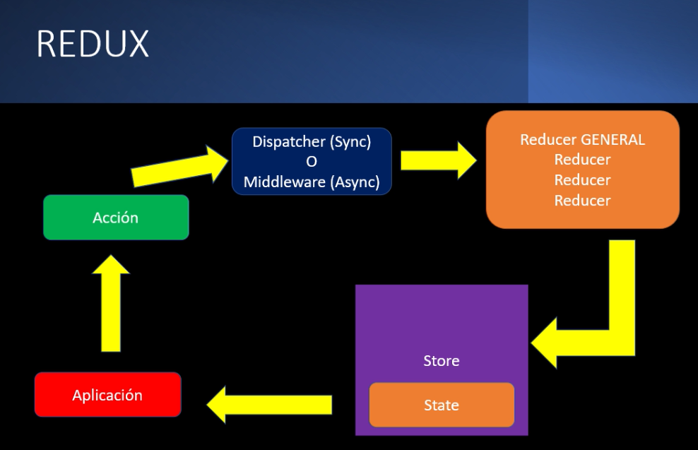

# Sección 19: Firebase, Redux y Materialize

## Creación del proyecto

```cmd
create-react-app calculadora-nominal --template cra-template-pwa
```

## REDUX

Es una librería de JavaScript independiente a React, pero muy utilizada en el mismo. Como tal es otra manera de manejar el state de tu información utilizando el enfoque del patrón **Store**, el cual es considerado un banco de la verdad, debido a que es donde se almacena todo lo relacionado al estado de una aplicación.




[Documentación Oficial de Redux en Español](https://es.redux.js.org/)

[Documentación de React Redux](https://react-redux.js.org/)

## Instalación de `react-redux` y `redux`

Para instalar ambas librerías se usó el comando:

```yarn
yarn add redux react-redux
```

## Servicio Firebase

Backend construido por Google a la que podemos acceder con una cuenta de Google. Para crear un nuevo proyecto accedemos a la sección de *Consola* y añadimos nuestro proyecto. Al no ser un proyecto comercial desactivamos las Google Analythics y esperamos a la creación del proyecto.

Dentro de la sección de *Authentication* vamos a encontrar diversos proveedores de acceso, para este ejercicio vamos a manejar un Proveedor Nativo (*Correo electrónico*) y un Proveedor Adicional (*Google*). Para el correo electrónico habilitamos por el momento solo la primera caracteristica, y para la opción de Google habilitamos también la primera opción, pero añadimos un correo para la asistencia del proyecto.

## Integrando Materialize CSS

Para integrar [Materialize](https://materializecss.com/) utilizamos el CDN que nos ofrece y lo copiamos dentro del archivo `public/index.html` en el sector de head.

```html
<!-- Compiled and minified CSS -->
<link rel="stylesheet" href="https://cdnjs.cloudflare.com/ajax/libsmaterialize/1.0.0/css/materialize.min.css">

<!-- Compiled and minified JavaScript -->
<script src="https://cdnjs.cloudflare.com/ajax/libs/materialize/1.0.0js/materialize.min.js"></script>
```

## Rutas de la aplicación

Para añadir la librería de `react-router-dom` se usó el siguiente comando:

```yarn
yarn add react-router-dom
```

```js
<BRouter>
    <Switch>
        <Route exact path="/login" component={LoginScreen}/>
        <Route exact path="/register" component={RegisterScreen} />
    </Switch>
</BRouter>
```
