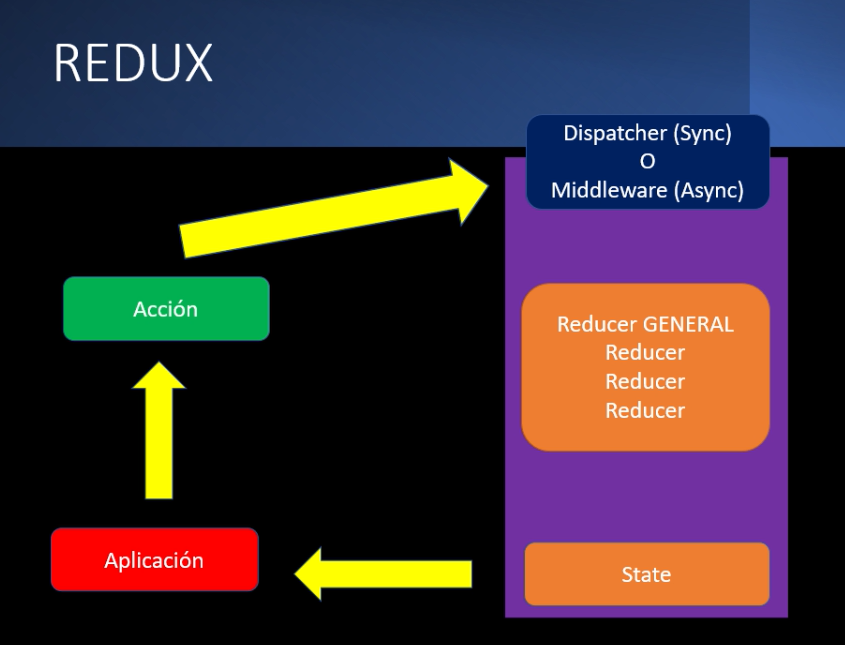

# Sección 19: Firebase, Redux y Materialize

## Creación del proyecto

```cmd
create-react-app calculadora-nominal --template cra-template-pwa
```

## REDUX

Es una librería de JavaScript independiente a React, pero muy utilizada en el mismo. Como tal es otra manera de manejar el state de tu información utilizando el enfoque del patrón **Store**, el cual es considerado un banco de la verdad, debido a que es donde se almacena todo lo relacionado al estado de una aplicación.




[Documentación Oficial de Redux en Español](https://es.redux.js.org/)

[Documentación de React Redux](https://react-redux.js.org/)

## Instalación de `react-redux` y `redux`

Para instalar ambas librerías se usó el comando:

```yarn
yarn add redux react-redux
```
